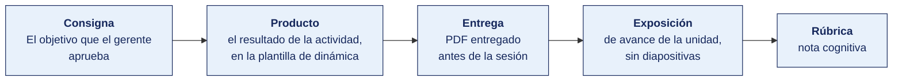

[Semana 12](README.md) · [Teoría](1-TEORIA.md) · **Dinámica de aula** · [Taller de laboratorio](3-TALLER.md)

# Dinámica de aula · El objetivo que el gerente aprueba

**SI-886 · Planeamiento Estratégico de TI** · Semana 12 · **Trabajo previo a la sesión** · calificación **cognitiva**

> ¿Un término no le resulta claro? Está definido en el [glosario técnico del curso](../GLOSARIO.md).

---

> **Esta actividad no se resuelve en aula.** La semana de cierre de unidad dedica sus 100 minutos de aula a la **exposición de avance (60 min)** y al **examen teórico (40 min)**. La dinámica se prepara durante la semana y **se entrega antes de la sesión**. Es el insumo con el que el equipo arma su exposición.

## Cómo funciona la actividad

## Qué entregas

| | |
|---|---|
| **Archivo** | `SI886-S12-DINAMICA-Grupo<N>.pdf` |
| **Plantilla obligatoria** | [SI886-PLANTILLA-DINAMICA.docx](../PLANTILLAS/SI886-PLANTILLA-DINAMICA.docx) |
| **Formato** | PDF exportado desde la plantilla en Word, con la carátula de la UPT y los apellidos, nombres y códigos de todos los integrantes |
| **Qué va dentro** | El producto de cierre de unidad que se describe más abajo, desarrollado por el grupo con la evidencia acumulada en la unidad |
| **Dónde se sube** | Aula virtual, tarea «Dinámica · Semana 12» |
| **Cuándo vence** | Al cierre de la unidad, antes del examen |
| **Exposición** | En la **exposición de avance de la unidad**, dentro de esta misma sesión. El grupo lee y explica su resultado ante el aula. No se usan diapositivas |

> No se califica un trabajo entregado en `.docx`, sin carátula, sin los códigos de los integrantes o con las tablas del producto vacías.

---

> La nota cognitiva de esta semana se compone de la **exposición de la Semana 11** y del **examen de unidad**.

**Producto adicional obligatorio, entregado al cierre de la unidad.**

> **«El objetivo que el gerente aprueba»** — Un producto por equipo con **un solo objetivo** del PETI, formulado para que la gerencia general lo apruebe — enunciado SMART, línea base con su fuente, meta a tres años, el proyecto que lo alcanza, la inversión estimada y **qué gana la organización expresado en dinero, tiempo o riesgo evitado**.

Restricción — **prohibido el vocabulario técnico**. Si el producto menciona una tecnología por su nombre, no se califica.

---

## Consigna

> **«El objetivo que el gerente aprueba»**
> Un producto por equipo con **un solo objetivo** del PETI, formulado para que la gerencia general lo apruebe — enunciado SMART, línea base con su fuente, meta a tres años, el proyecto que lo alcanza, la inversión estimada y **qué gana la organización expresado en dinero, tiempo o riesgo evitado**.

| | |
|---|---|
| **Su papel** | **Jefe de TI** presentando el objetivo ante la gerencia general, que decide si lo financia |
| **Misión** | Formular un objetivo que la gerencia apruebe, con su línea base, su meta, el proyecto que lo alcanza y su inversión |
| **Restricción** | **Lo que gana la organización se expresa en dinero, tiempo o riesgo evitado.** «Mejorar la eficiencia» no es un beneficio, es un deseo |

## Cómo se prepara

**Paso 1 · Elegir el objetivo.** De todos los del PETI se elige **uno**, el que la gerencia entendería sin explicación previa. No el más ambicioso ni el más técnico.

**Paso 2 · Buscar la línea base.** El valor de hoy, con la fuente del dato nombrada. Un objetivo sin línea base no se puede aprobar porque no se puede verificar después.

**Paso 3 · Fijar la meta.** El valor a tres años con su fecha. Debe ser alcanzable con el proyecto que se propone, no con el que haría falta.

**Paso 4 · Costear el proyecto.** El proyecto de la cartera que lo alcanza, nombrado, con su inversión en soles.

**Paso 5 · Traducir el beneficio.** Qué gana la organización, en dinero, en tiempo o en riesgo evitado. Es el paso que decide la aprobación y el que más se omite.

## Producto

**Un solo producto**, que va en la sección 2 de la plantilla, «El producto», con **un solo objetivo** del PETI (Plan Estratégico de Tecnologías de Información).

| Campo | Contenido |
|---|---|
| Enunciado del objetivo | Formulado en términos de resultado para la organización, no de tecnología |
| Línea base | El valor de hoy, con la fuente del dato |
| Meta a tres años | El valor al que se llega, con su fecha |
| Proyecto que lo alcanza | Cuál de la cartera, nombrado |
| Inversión estimada | En soles |
| Qué gana la organización | Expresado en **dinero, tiempo o riesgo evitado** |

**El producto se presenta como si el gerente general fuera a firmarla.**

> **Dónde va.** Este producto se presenta en la **sección 2 de la [plantilla de dinámica](../PLANTILLAS/SI886-PLANTILLA-DINAMICA.docx)**, «El producto». No se copia la consigna ni la teoría. Solo el resultado y lo que lo sostiene.

## Ejemplo resuelto

*El caso de este ejemplo es distinto del que le toca a tu grupo. Sirve para que veas el nivel de detalle que se espera, no para copiarlo.*

**Un objetivo bien formulado para la gerencia.** La organización del ejemplo es una empresa de distribución.

> **Objetivo.** Reducir de 5 días a 1 día el tiempo entre que un cliente hace un pedido y recibe la confirmación con fecha de entrega, para el 80 % de los pedidos, al cierre del tercer año.
>
> **Línea base.** 5,2 días en promedio, medidos sobre los 4 180 pedidos del último trimestre. **Fuente.** Registro de pedidos del sistema comercial, contrastado con la fecha de correo de confirmación.
>
> **Meta a tres años.** Año 1. 3 días. **Año 2.** 2 días. Año 3. 1 día para el 80 % de los pedidos.
>
> **Proyecto que lo alcanza.** Portal de pedidos con verificación automática de stock y crédito del cliente.
>
> **Inversión estimada.** S/ 145 000 de inversión inicial y S/ 28 000 anuales de operación.
>
> **Qué gana la organización.** Cada día de demora en confirmar cuesta pedidos. El 11 % de los pedidos del último trimestre se anuló antes de confirmarse, y el motivo registrado en 61 de esos casos fue «el cliente compró a otro proveedor». Sobre un ticket promedio de S/ 2 400, la anulación por demora representa del orden de S/ 1,1 millones anuales. Reducir la confirmación a un día recupera una parte de ese volumen y libera al equipo comercial de 340 horas mensuales de seguimiento telefónico.

**Por qué esta diapositiva se aprueba.** No menciona ninguna tecnología. Dice qué cambia para el cliente, cuánto, para cuándo y qué gana la organización en dinero. Un gerente puede decidir con esto.

**La diferencia entre aprobar y no aprobar.**

| Así no | Así sí |
|---|---|
| «Implementar un portal web con integración al ERP mediante API REST.» | «Reducir de 5 días a 1 el tiempo de confirmación de pedido para el 80 % de los pedidos.» |
| «Meta: 80 % de digitalización.» | «Línea base 5,2 días, medidos sobre 4 180 pedidos del último trimestre. Año 1: 3 días. Año 2: 2. Año 3: 1.» |
| «Beneficio: mayor eficiencia y satisfacción del cliente.» | «El 11 % de los pedidos se anuló antes de confirmarse; en 61 casos el motivo fue que el cliente compró a otro proveedor. Del orden de S/ 1,1 millones anuales.» |

## Reglas

- Se entrega **antes de la sesión de cierre de unidad**, no se resuelve en aula.
- **Prohibido el vocabulario técnico.** Si el producto nombra una tecnología, no se califica.
- La línea base debe citar su fuente. Un objetivo sin línea base no se puede aprobar ni medir.
- El beneficio debe ser una cifra, no una promesa.
- Exposición de 6 minutos por equipo en la sesión de cierre.

## Rúbrica cognitiva (20 puntos)

| Criterio | 5 | 3 | 1 |
|---|---|---|---|
| **Formulación del objetivo** | Enunciado como resultado medible para la organización | Es un resultado, pero vago o sin unidad | Es una actividad o una tecnología, no un resultado |
| **Línea base con fuente** | Valor actual con institución, documento y fecha | Hay valor sin fuente verificable | No hay línea base |
| **Beneficio cuantificado** | En soles, horas o riesgo evitado, con el supuesto declarado | Cuantificado sin declarar el supuesto | Beneficio enunciado sin cifra |
| **Lenguaje de gerencia** | Ninguna tecnología nombrada; se entiende sin saber de TI | Una mención técnica | El producto es técnica |

---

[Semana 12](README.md) · [Teoría](1-TEORIA.md) · **Dinámica de aula** · [Taller de laboratorio](3-TALLER.md)

---

**Docente** · Dr. Oscar Juan Jimenez Flores
[oscarjimenezflores@upt.pe](mailto:oscarjimenezflores@upt.pe) · [LinkedIn](https://www.linkedin.com/in/oscar-jimenez-flores/) · [CTI Vitae — CONCYTEC](https://ctivitae.concytec.gob.pe/appDirectorioCTI/VerDatosInvestigador.do?id_investigador=33398)

Escuela Profesional de Ingeniería de Sistemas · Universidad Privada de Tacna · Tacna, Perú
