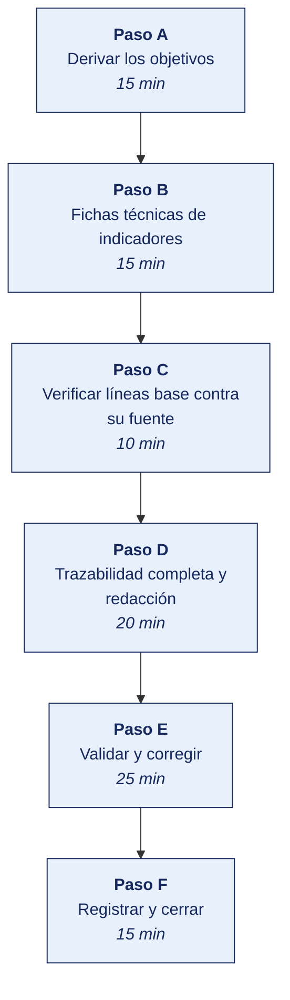

[Semana 12](README.md) · [Teoría](1-TEORIA.md) · [Dinámica de aula](2-DINAMICA.md) · **Taller de laboratorio**

# Taller de laboratorio 12 · Formulación de objetivos, indicadores y metas

**SI-886 · Planeamiento Estratégico de TI** · Semana 12 · Sesión 2 en laboratorio · 100 min · calificación **procedimental**

> ¿Un término no le resulta claro? Está definido en el [glosario técnico del curso](../GLOSARIO.md).

---

## Secuencia del taller



## Qué entregas

| | |
|---|---|
| **Archivo** | `SI886-S12-TALLER-Grupo<N>.pdf` |
| **Plantilla obligatoria** | [SI886-PLANTILLA-TALLER.docx](../PLANTILLAS/SI886-PLANTILLA-TALLER.docx) |
| **Formato** | PDF exportado desde la plantilla en Word, con la carátula de la UPT, el índice actualizado y las capturas numeradas |
| **Qué va dentro** | Las secciones de la plantilla. La **5. Resultados y evidencias** se califica contra la tabla de resultados esperados de esta guía, y **cada resultado necesita la evidencia que lo demuestre**. No se copian de aquí los objetivos, la duración ni los resultados de aprendizaje |
| **Dónde se sube** | Aula virtual, tarea «Taller · Semana 12» |
| **Cuándo vence** | 48 horas después de la sesión de laboratorio de la semana, se desarrolle el taller dentro de ella o fuera de ella |

> No se califica un informe entregado en `.docx`, sin carátula, sin los códigos de los integrantes o con resultados declarados sin evidencia.

---

## El reto

| | |
|---|---|
| **Situación** | El plan tiene estrategias pero ningún objetivo que la gerencia pueda aprobar ni medir. |
| **Misión** | Formular entre cinco y ocho objetivos con su indicador, su línea base y su meta, todos trazables al diagnóstico. |
| **Criterio de éxito** | Ningún objetivo se aprueba sin línea base con fuente. Un objetivo sin punto de partida no se puede evaluar. |

## 1. Información sobre el evento práctico

### 1.1. Objetivos

- Formular entre **cinco y ocho objetivos** derivados de las estrategias y del diagnóstico.
- Verificar que cada enunciado cumple los cinco atributos **SMART**.
- Construir la **ficha técnica** completa de cada indicador.
- Verificar la **línea base** de cada indicador contra su fuente real.
- Establecer **metas anuales** con su justificación de alcanzabilidad.
- Validar la **proporción de indicadores** de resultado, producto e impacto.
- Verificar la **trazabilidad completa** evidencia → factor → estrategia → objetivo → proyecto.
- Redactar la **Sección 6.2** del PETI (Plan Estratégico de Tecnologías de Información).

### 1.2. Recursos

| Recurso | Detalle |
|---|---|
| Secciones Sección 3.5, Sección 4.3, Sección 5.4 y Sección 6.1 del PETI | Insumos obligatorios |
| **CEPLAN** — Guía para el Planeamiento Institucional | https://www.gob.pe/ceplan |
| **D. S. 085-2023-PCM** | Objetivos prioritarios de la Política Nacional de Transformación Digital |
| **Python 3.11+** con `pandas` | Validación de la trazabilidad |
| **LibreOffice Calc** | Fichas de indicadores |
| **Metabase** de la Semana 11 | Verificación de líneas base |

### 1.3. Seguridad

1. Las líneas base contienen información operativa y de desempeño de la organización. **Confidencial**.
2. Ninguna línea base se declara sin verificar contra su fuente. **Un valor inventado invalida la evaluación futura del plan** y expone al equipo formulador.
3. Las metas se acuerdan con la contraparte de la organización, no se imponen. Quien no participó en fijar la meta no se compromete con ella.
4. Los supuestos de cada meta se documentan explícitamente para proteger al plan de una evaluación injusta.

---

## 2. Procedimiento o Metodología

### Paso A — Derivar los objetivos

**Método de derivación** —los objetivos no se inventan, se agregan desde las estrategias:

```python
# 06_gobierno_digital/OB01_derivacion.py
import pandas as pd
e = pd.read_csv("../03_diagnostico/PE04_estrategias_priorizadas.csv")

# Agrupación de estrategias en objetivos · varias estrategias pueden servir al mismo resultado
AGRUPACION = {
 "OD-01 Canal digital": ["E-01","E-06","E-03"],
 "OD-02 Decisión basada en datos": ["E-05"],
 "OD-03 Eficiencia logística": ["E-02"],
 "OD-04 Continuidad y seguridad": ["E-04","E-09"],
 "OD-05 Cumplimiento normativo": ["E-08"],
 "OD-06 Reducción del riesgo de personal clave": ["E-07"],
}
for obj, ests in AGRUPACION.items():
    sub = e[e.id.isin(ests)]
    print(f"\n{obj}")
    print(f"  Estrategias: {', '.join(ests)} |  peso agregado: {sub.peso_factores.sum():.3f}")
    for _, s in sub.iterrows():
        print(f"    · [{s.Tipo}] {s.Estrategia[:100]}...")
```

`06_gobierno_digital/OB02_objetivos.csv`:

| Código | **Enunciado SMART** | Componente de gobierno digital | Objetivo superior al que se articula | Estrategias que lo sustentan | Paquetes de trabajo | Responsable (cargo) |
|---|---|---|---|---|---|---|
| **OD-01** | Elevar la proporción de pedidos originados en canal digital del **4 %** al **60 %** del volumen anual, al cierre del año 3 | Servicios digitales | **Objetivo de negocio.** Ampliar cobertura y reducir costo de venta | E-01, E-03, E-06 | PT-01, PT-02, PT-03 | Gerencia Comercial |
| **OD-02** | Alcanzar que el **100 %** de las seis entidades de información críticas cuente con fuente autoritativa y dueño designado, desde **0 %**, al cierre del año 1 | Datos | **Objetivo de negocio.** Decidir con información confiable | E-05 | PT-01 | Gerencia General |
| **OD-03** | Reducir el costo de despacho por pedido de **S/ 1,12** a **S/ 0,85**, al cierre del año 3 | Servicios digitales · Datos | Objetivo de negocio: eficiencia operativa | E-02 | PT-01, PT-04 | Gerencia de Operaciones |
| **OD-04** | Alcanzar el **99,5 %** de disponibilidad mensual de los servicios críticos, desde una línea base **no medida**, y sostener una prueba de restauración semestral exitosa, al cierre del año 2 | Seguridad digital | **Objetivo de negocio.** Continuidad del servicio | E-04, E-09 | PT-07, PT-08 | Jefatura de TI |
| **OD-05** | Alcanzar el **100 %** de cumplimiento de las obligaciones normativas de protección de datos personales, desde el **18 %** actual, al cierre del año 1 | Seguridad digital · Datos | Cumplimiento legal obligatorio | E-08 | PT-01, proyecto de cumplimiento | Gerencia General |
| **OD-06** | Reducir a **cero** las capacidades críticas de TI que dependen de una sola persona, desde **3** actuales, al cierre del año 2 | Talento y cultura digital | **Objetivo de negocio.** Reducir el riesgo operativo | E-07 | PT-06, gestión del conocimiento | Jefatura de TI y RR. HH. |

### Paso B — Fichas técnicas de indicadores

`06_gobierno_digital/OB03_fichas_indicadores.md` — una por indicador:

```markdown
### Ficha del indicador OD-01.I1

| Campo | Contenido |
|---|---|
| **Objetivo** | OD-01 · Elevar la proporción de pedidos originados en canal digital |
| **Nombre del indicador** | Proporción de pedidos originados en canal digital |
| **Definición** | Porcentaje de pedidos cuyo registro inicial fue realizado por el propio cliente a través del portal o de la aplicación móvil, sin intervención de un vendedor |
| **Tipo** | **Resultado** |
| **Fórmula** | (N.º de pedidos con origen = «portal» o «app») / (N.º total de pedidos del periodo) × 100 |
| **Unidad** | Porcentaje |
| **Fuente del dato** | ERP Ventas, tabla `pedidos`, campo `canal_origen` |
| **Método de recolección** | Consulta automática mensual sobre el ERP |
| **Frecuencia** | Mensual, con reporte trimestral a la gerencia |
| **Responsable de la medición** | Jefatura de TI |
| **Responsable del resultado** | Gerencia Comercial |
| **Línea base** | **4,0 %** — medido el dd/mm/aaaa sobre 6 200 pedidos del mes |
| **Meta año 1** | 20 % |
| **Meta año 2** | 40 % |
| **Meta año 3** | **60 %** |
| **Sentido** | Ascendente |
| **Umbral de alerta** | Si al cierre de un trimestre el valor está más de 5 puntos por debajo de la trayectoria prevista, se activa revisión del proyecto PT-03 |
| **Supuestos** | Que el portal esté integrado al ERP y al inventario en tiempo real (PT-02, PT-03); que se ejecute el programa de acompañamiento a clientes; que la penetración de smartphone en el segmento se mantenga |
| **Limitaciones** | No mide la satisfacción del cliente con el canal ni el valor de los pedidos digitales frente a los presenciales; se complementa con OD-01.I2 |
```

**Los indicadores mínimos por objetivo.** Al menos uno de resultado. Los objetivos de mayor peso llevan además un indicador de impacto.

**El programa está en [`HERRAMIENTAS/SEMANA-12/OB04_valida_indicadores.py`](../HERRAMIENTAS/SEMANA-12/OB04_valida_indicadores.py).** Se copia al repositorio del equipo como `06_gobierno_digital/OB04_valida_indicadores.py` y **se edita con los datos de su organización**. El programa hace el cálculo, las cifras y su justificación son del equipo.

```bash
cp ../HERRAMIENTAS/SEMANA-12/OB04_valida_indicadores.py 06_gobierno_digital/OB04_valida_indicadores.py
python3 06_gobierno_digital/OB04_valida_indicadores.py
```

### Paso C — Verificar líneas base contra su fuente

**El paso que separa un plan evaluable de uno decorativo.** Para cada indicador se ejecuta la consulta real:

| Indicador | Consulta o procedimiento de verificación | Valor obtenido | ¿Coincide con la línea base declarada? | Evidencia |
|---|---|---|---|---|
| OD-01.I1 | `SELECT COUNT(*) FILTER (WHERE canal_origen IN ('portal','app'))::float / COUNT(*) * 100 FROM pedidos WHERE fecha BETWEEN '<inicio del periodo>' AND '<fin del periodo>'` | 4,0 % | Sí | Captura de la consulta |
| OD-02.I1 | Conteo manual sobre `AR02_entidades.csv`. Entidades con dueño designado | 0 de 6 | Sí | Sección 5.2.2 |
| OD-03.I1 | Costo de despacho del mes / n.º de pedidos, según contabilidad analítica | S/ 1,12 | Sí | Reporte contable |
| OD-04.I1 | **No existe herramienta de monitoreo** | **No medible** | **No hay línea base** | — |
| OD-05.I1 | Obligaciones en estado «Cumple» / total, según `NO03_matriz_cumplimiento.csv` | 18 % | Sí | Sección 4.1.3 |
| OD-06.I1 | Capacidades críticas con una sola persona, según sección 3.1.5 y Sección 4.3 | 3 | Sí | Diagnóstico |

> **Cuando no hay línea base**, como en OD-04.I1, el objetivo se reformula en dos etapas. **(1)** instrumentar la medición durante el primer año y establecer la línea base; **(2)** alcanzar la meta en los años siguientes. **Declarar una meta sin línea base garantiza que el plan no podrá evaluarse.**

### Paso D — Trazabilidad completa y redacción

**El programa está en [`HERRAMIENTAS/SEMANA-12/OB05_trazabilidad.py`](../HERRAMIENTAS/SEMANA-12/OB05_trazabilidad.py).** Se copia al repositorio del equipo como `06_gobierno_digital/OB05_trazabilidad.py` y **se edita con los datos de su organización**. El programa hace el cálculo, las cifras y su justificación son del equipo.

```bash
cp ../HERRAMIENTAS/SEMANA-12/OB05_trazabilidad.py 06_gobierno_digital/OB05_trazabilidad.py
python3 06_gobierno_digital/OB05_trazabilidad.py
```

```markdown
## 6.2 Objetivos, indicadores y metas

### 6.2.1 Método de derivación de los objetivos
De las estrategias del FODA cruzado (Sección 3.5) y de las brechas de capacidad (Sección 4.3),
de arquitectura (Sección 5.4) y de gobierno digital (Sección 6.1) a los objetivos del plan.

### 6.2.2 Objetivos del plan
Matriz de los N objetivos con enunciado SMART, articulación superior, estrategias,
paquetes de trabajo y responsable por cargo.

### 6.2.3 Fichas técnicas de los indicadores
Una ficha completa por indicador, con los 14 campos.

### 6.2.4 Verificación de las líneas base
Tabla de verificación: consulta ejecutada, valor obtenido y evidencia.
**Indicadores sin línea base: N — con su objetivo reformulado en dos etapas.**

### 6.2.5 Metas anuales y su justificación de alcanzabilidad
Tabla de metas por año, con el supuesto que sostiene cada trayectoria.

### 6.2.6 Composición del cuadro de indicadores
Proporción de indicadores de resultado, producto e impacto, con su interpretación.

### 6.2.7 Trazabilidad y cobertura
Cadena completa por objetivo. Componentes de gobierno digital cubiertos y no cubiertos,
con la justificación del alcance.
```

### Paso E — Validar y corregir (25 min)

El resultado no vale por estar hecho, sino por resistir una comprobación. Se ejecutan estas tres y **se corrige lo que falle antes de cerrar la sesión**.

1. Comprobar que cada objetivo cumple los cinco atributos SMART, uno por uno.
2. Verificar que cada línea base trae la fuente del dato y su fecha.
3. Comprobar que cada objetivo se rastrea hasta una brecha del diagnóstico y hasta un objetivo institucional.

> Lo que no se pueda corregir hoy se anota en la sección **Problemas y mejoras** de la evidencia, con lo que faltó y por qué. Un resultado parcial documentado con honestidad vale más que uno declarado sin prueba.

### Paso F — Registrar la evidencia y cerrar (15 min)

Se versiona lo producido, se anota la URL de cada resultado y se responde en dos frases la pregunta de transferencia — **qué riesgo correría una organización real si esto se hiciera mal**.

```bash
git add . && git commit -m "S12: objetivos, indicadores y metas — seccion 6.2"
git tag -a v0.12 -m "PETI v0.12 — objetivos e indicadores (cierre de Unidad II)"
```

---

## 3. Resultados

> **Evidencia obligatoria en GitHub.** Todo resultado de este taller se versiona en el repositorio del equipo. El informe **no consigna capturas sueltas**. Consigna la **URL** del artefacto en GitHub. Una captura no permite verificar autoría, fecha ni contenido; un enlace sí.
>
> | Qué se entrega | Dónde vive | Qué se escribe en el informe |
> |---|---|---|
> | Código y archivos de configuración | Rama del taller, fusionada a `develop` vía Pull Request | URL del Pull Request |
> | Documentos y matrices | `docs/`, en formato de texto versionable | URL del archivo en la rama |
> | Capturas y videos que el taller exija | `docs/evidencias/S12/` | URL del archivo |
> | Salida de comandos | `docs/evidencias/S12/salidas/*.txt` | URL del archivo |
>
> **Etiqueta del taller.** Al cerrar el taller se crea la etiqueta `taller-12` sobre el commit entregado:
>
> ```bash
> git tag -a taller-12 -m "Taller 12 · SI886"
> git push origin taller-12
> ```
>
> La URL que se consigna en el informe apunta a esa etiqueta:
> `https://github.com/<organizacion>/<repositorio>/tree/taller-12`
>
> **El informe es lo que se califica; el repositorio es lo que lo prueba.** Cada resultado de la sección 3 del informe lleva la URL con la que se verifica, y **un resultado sin su URL se califica como no logrado**, por bien redactado que esté. Lo que no se puede abrir no se puede dar por hecho.

### 3.1. Los tres resultados que se califican

Son los que la rúbrica evalúa. El resto de la lista tiene que existir, pero no se califica fila por fila.

| Resultado | Qué demuestra | Dónde está |
|---|---|---|
| **Los objetivos SMART** | Entre cinco y ocho, los cinco atributos verificados uno a uno | Sección 6.1 |
| **La ficha del indicador** | Fórmula, fuente, periodicidad y responsable, por cada objetivo | Fichas de indicador |
| **La trazabilidad** | Cada objetivo hasta su brecha y hasta el objetivo institucional | Matriz de trazabilidad |

### 3.2. Lista de comprobación del taller

Todo esto debe existir al cerrar la sesión.

| # | Resultado esperado | Verificación |
|---|---|---|
| 1 | Entre **5 y 8 objetivos**, todos derivados de estrategias con evidencia | `OB02_objetivos.csv` |
| 2 | **Cero objetivos formulados como proyectos** (sin verbos «implementar», «desarrollar», «adquirir») | Revisión de enunciados |
| 3 | Cada objetivo con los **cinco atributos SMART** verificables | Misma tabla |
| 4 | Cada objetivo articulado a un **objetivo institucional o de negocio** | Misma tabla |
| 5 | Ficha técnica completa por indicador, con los **14 campos** | `OB03_fichas_indicadores.md` |
| 6 | Validador de fichas ejecutado. **Cero campos faltantes** | Salida de `OB04_valida_indicadores.py` |
| 7 | **Línea base verificada contra su fuente real** en cada indicador medible | Tabla del Paso C |
| 8 | Indicadores **sin línea base** identificados y sus objetivos reformulados en dos etapas | Sección 6.2.4 |
| 9 | **≥ 60 % de indicadores de resultado**; al menos un indicador de impacto | Salida del validador |
| 10 | Metas anuales con **supuestos explícitos** de alcanzabilidad | Sección 6.2.5 |
| 11 | Trazabilidad completa verificada. **Cero objetivos sin evidencia trazable** | Salida de `OB05_trazabilidad.py` |
| 12 | Componentes de gobierno digital sin objetivo identificados y **justificados** | Sección 6.2.7 |
| 13 | Sección 6.2 redactada · etiqueta `v0.12` | `git tag` |

## Rúbrica procedimental (20 puntos)

Se aplica sobre el informe entregado y la evidencia enlazada en el repositorio. **Cada criterio se califica de forma independiente.**

| Criterio | 4 — Logrado | 2 — En proceso | 0 — Insuficiente |
|---|---|---|---|
| **El criterio de éxito** | Se cumple tal como lo pide el reto de esta sesión | Se cumple con reservas que el equipo declara | No se cumple, o se afirma cumplido sin prueba |
| **Los objetivos SMART** | Completo y correcto, con la evidencia que lo respalda | Completo con errores menores, o correcto sin toda la evidencia | Incompleto o sin evidencia |
| **La ficha del indicador** | Completo y correcto, con la evidencia que lo respalda | Completo con errores menores, o correcto sin toda la evidencia | Incompleto o sin evidencia |
| **La trazabilidad** | Completo y correcto, con la evidencia que lo respalda | Completo con errores menores, o correcto sin toda la evidencia | Incompleto o sin evidencia |
| **La validación** | Las tres comprobaciones ejecutadas, y lo que falló quedó corregido o documentado | Ejecutadas sin corregir lo que falló | No se validó nada |

| Puntaje | Equivalencia |
|---|---|
| 18 – 20 | Destacado |
| 14 – 17 | Logrado |
| 6 – 13 | En proceso |
| 0 – 5 | Insuficiente |

> **Un resultado declarado sin evidencia enlazada no se califica**, aunque el trabajo se haya hecho. La tabla de la sección 3.1 es la lista de cotejo; esta rúbrica es lo que determina la nota.

## 4. Conclusiones

Mínimo tres. Líneas argumentales esperadas:

1. Un enunciado que empieza con «implementar» es un proyecto disfrazado de objetivo; el plan que confunde ambos puede ejecutarse íntegramente sin que ningún resultado cambie.
2. Un cuadro de indicadores dominado por métricas de producto permite declarar cumplimiento sin demostrar valor, y es la razón más frecuente por la que las gerencias dejan de financiar los planes de TI.
3. La línea base verificada contra su fuente es lo que hace evaluable un plan. Declarar una meta sobre un valor no medido garantiza que al final del periodo nadie podrá demostrar avance ni retroceso.

## 5. Referencias Bibliográficas

- CEPLAN. *Guía para el Planeamiento Institucional* — formulación de objetivos e indicadores. https://www.gob.pe/ceplan
- Decreto Supremo 085-2023-PCM, Política Nacional de Transformación Digital al 2030 — objetivos prioritarios e indicadores. https://busquedas.elperuano.pe/dispositivo/NL/2200457-5
- Resolución de Secretaría de Gobierno Digital 005-2018-PCM/SEGDI, Anexo I. https://cdn.www.gob.pe/uploads/document/file/356863/Anexo_I_Lineamientos_PGD.pdf
- ISACA. (2018). *COBIT 2019*, metas y métricas de los objetivos de gobierno y gestión. https://www.isaca.org/resources/cobit
- Kaplan, R. S. y Norton, D. P. (1996). *The Balanced Scorecard*. Harvard Business School Press.
- González Millán, J. (2020). *Manual práctico de planeación estratégica*. Ediciones Díaz de Santos. https://elibro.net/es/lc/bibliotecaupt/titulos/129291
- Rodríguez Bermúdez, J. R. (2015). *Planificación y dirección estratégica de sistemas de información*. Editorial UOC. https://elibro.net/es/lc/bibliotecaupt/titulos/57875
- ISO/IEC 27004. *Information security management — Monitoring, measurement, analysis and evaluation*. https://www.iso.org/standard/80404.html

## 6. Anexos

- `anexo_A_objetivos.xlsx`
- `anexo_B_fichas_indicadores.pdf`
- `anexo_C_verificacion_lineas_base.pdf`
- `anexo_D_trazabilidad_completa.xlsx`
- `anexo_E_seccion_6_2.pdf`

---

---

[Semana 12](README.md) · [Teoría](1-TEORIA.md) · [Dinámica de aula](2-DINAMICA.md) · **Taller de laboratorio**

---

**Docente** · Dr. Oscar Juan Jimenez Flores
[oscarjimenezflores@upt.pe](mailto:oscarjimenezflores@upt.pe) · [LinkedIn](https://www.linkedin.com/in/oscar-jimenez-flores/) · [CTI Vitae — CONCYTEC](https://ctivitae.concytec.gob.pe/appDirectorioCTI/VerDatosInvestigador.do?id_investigador=33398)

Escuela Profesional de Ingeniería de Sistemas · Universidad Privada de Tacna · Tacna, Perú
