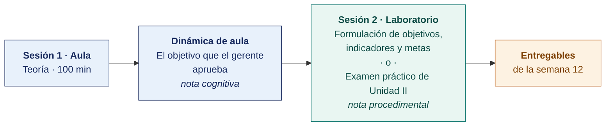

  
  &nbsp;&nbsp;&nbsp;&nbsp;&nbsp;&nbsp;
  

  <strong>Universidad Privada de Tacna</strong> 
  Facultad de Ingeniería · Escuela Profesional de Ingeniería de Sistemas

<h1 align="center">Semana 12 · Objetivos del Gobierno Digital · Indicadores y Metas · Examen de Unidad II</h1>

  <strong>SI-886 · Planeamiento Estratégico de TI</strong> 
  4 horas académicas de 50 min · 100 min de exposiciones y examen de unidad en aula · 100 min de taller en laboratorio

---

## Datos de la asignatura

| | |
|---|---|
| **Asignatura** | SI-886 · Planeamiento Estratégico de TI |
| **Escuela** | Escuela Profesional de Ingeniería de Sistemas |
| **Ciclo** | VIII · 04 horas semanales · 03 créditos · Obligatorio |
| **Unidad** | II — Plan de Gobierno Digital (cierre) |
| **Semana** | 12 de 17 |
| **Duración** | 4 horas académicas de 50 min · 100 min de exposiciones y examen de unidad en aula · 100 min en laboratorio, compartidos entre el taller y el examen práctico |
| **Resultados de aprendizaje** | **RA1** Analiza la normativa y herramientas TI · **RA2** Evalúa la situación actual del gobierno digital |

### Lo que indica el sílabo

**Contenido conceptual.** Objetivos del gobierno digital.

**Contenido procedimental.** Define los objetivos del gobierno digital.

## Materiales de esta semana

| | Documento | Qué encontrarás | Dónde y cuánto dura |
|---|---|---|---|
| 1 | **[Teoría](1-TEORIA.md)** | Cómo se formula un objetivo que sirve · La ficha técnica del indicador · La articulación y la cadena completa | Aula · 100 min |
| 2 | **[Dinámica de aula](2-DINAMICA.md)** | El objetivo que el gerente aprueba, con su material, su ejemplo resuelto y su rúbrica | **Trabajo previo**, se entrega antes de la sesión |
| 3 | **[Taller de laboratorio](3-TALLER.md)** | Formulación de objetivos, indicadores y metas | Laboratorio · 100 min · **comparte sesión con el examen práctico** |

> **El laboratorio de esta semana lo reclaman dos documentos y solo caben los 100 minutos de una sesión.** El **examen práctico** y el **[taller](3-TALLER.md)** están escritos completos y son independientes entre sí. El docente publica en el aula virtual el que ocupará la sesión y deja el otro como trabajo fuera de ella, y lo comunica al inicio de la semana. **El plazo no cambia con esa decisión** — ambos vencen contando desde la sesión de laboratorio, que se dicta igual en cualquiera de los dos casos.

## Ruta de la semana

## Entregables

| Entregable | Formato y nombre del archivo | Vence |
|---|---|---|
| **Dinámica de aula** · El objetivo que el gerente aprueba | PDF desde la [plantilla de dinámica](../PLANTILLAS/SI886-PLANTILLA-DINAMICA.docx) · `SI886-S12-DINAMICA-Grupo<N>.pdf` | Antes de iniciar la sesión de aula |
| **Informe del taller de laboratorio N.º 12** | PDF en formato EPIS desde la [plantilla de taller](../PLANTILLAS/SI886-PLANTILLA-TALLER.docx) · `SI886-S12-TALLER-Grupo<N>.pdf` | 48 h después de la sesión de laboratorio |
| **Examen teórico de Unidad II** | Presencial, 40 min, Preguntas de alternativas | Sesión de aula |
| **Examen práctico de Unidad II** | 100 min, individual, con inteligencia artificial permitida y declarada | Sesión de laboratorio, si el docente le asigna la sesión |
| Sección 6.2 del PETI (Plan Estratégico de Tecnologías de Información) · etiqueta `v0.12` | Commit en Git | 48 h después de la sesión de laboratorio |

> Ambos se entregan en **PDF**, con la carátula de la UPT y los códigos de todos los integrantes. Las plantillas obligatorias están en [`PLANTILLAS/`](../PLANTILLAS/).

## Cómo se evalúa

| Criterio | Instrumento | Peso en la unidad |
|---|---|---|
| Actitudinal | Participación, puntualidad, profesionalismo con la organización y rigor en la citación de fuentes en las semanas 07–12 | 15 % |
| Cognitivo | Promedio de las rúbricas de las dinámicas S07–S11 + «El objetivo que el gerente aprueba» | 25 % |
| Procedimental | Promedio de las listas de cotejo de los laboratorios 07–12 + calidad de las secciones Sección 3.3 a Sección 6.2 | 35 % |
| Examen de Unidad | **Teórico** en aula, 40 min, banco de alternativas · **Práctico** en laboratorio, 100 min, sobre los productos de los talleres, con IA permitida | 25 % |
| | **La Unidad II aporta el 35 % de la nota final del curso** | |

## Preparación para la Unidad III

La Unidad III convierte el diagnóstico y los objetivos en un **plan ejecutable** — portafolio priorizado, presupuesto, riesgos, aprobación e implementación.

- **Confirmar la Entrevista 3 con la gerencia**. Criterios de priorización y disponibilidad presupuestal. Es el insumo obligatorio de la Semana 14.
- **Leer.** PMBOK o ISO 21500 — elementos del caso de negocio y de la ficha de proyecto.
- Recopilar — **presupuesto de TI de los últimos dos años y el proyectado**, y las necesidades tecnológicas pendientes que cada área haya manifestado.
- Instalar **GanttProject** (https://www.ganttproject.biz/) para la hoja de ruta de la Semana 14.

---

**Docente** · Dr. Oscar Juan Jimenez Flores
[oscarjimenezflores@upt.pe](mailto:oscarjimenezflores@upt.pe) · [LinkedIn](https://www.linkedin.com/in/oscar-jimenez-flores/) · [CTI Vitae — CONCYTEC](https://ctivitae.concytec.gob.pe/appDirectorioCTI/VerDatosInvestigador.do?id_investigador=33398)

Escuela Profesional de Ingeniería de Sistemas · Universidad Privada de Tacna · Tacna, Perú
